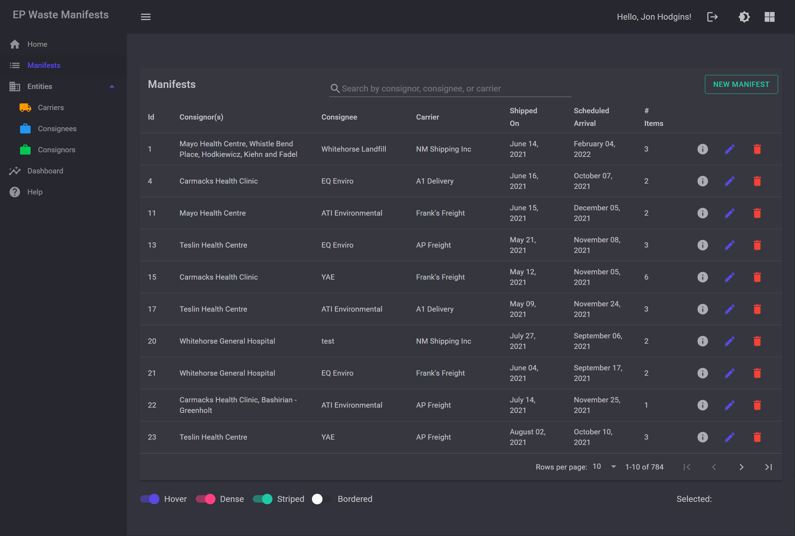
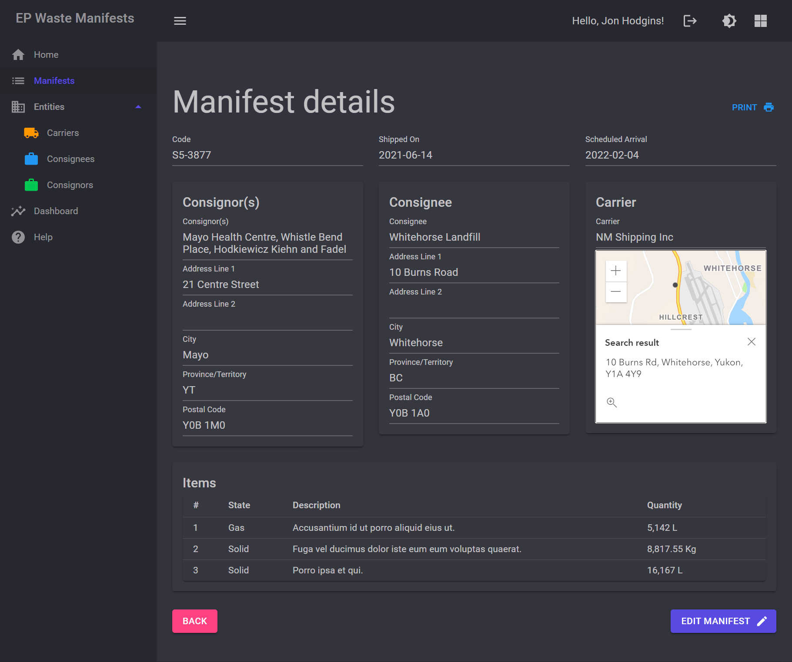
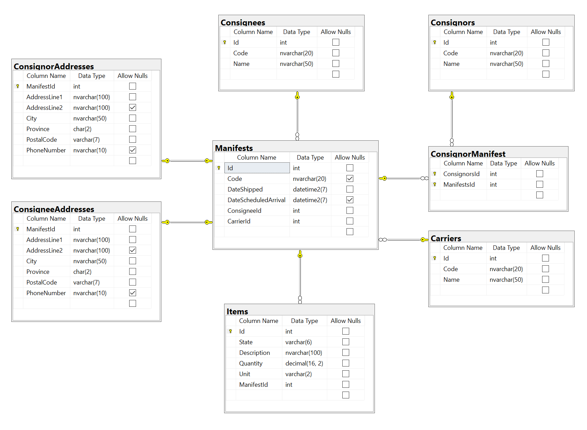

# Waste Manifests proof of concept

This is a proof of concept web application that demonstrates the use of web technologies to modernize internal apps at Environment. The Environmental Protection and Assessment branch’s Waste Manifest app was chosen for this demonstration. This app is used to track [Special Waste Manifests](https://yukon.ca/en/get-special-waste-permit).

>Waste Manifests, sometimes referred to as Movement Documents, are official documents that accompany shipments of special/hazardous waste in Yukon and other Canadian jurisdictions from their origin to their destination. They document information on: 
>* the waste generator (consignor)
>* the waste carrier (transporter)
>* the waste receiver (consignee) 
>* the waste being shipped
>
>All special/hazardous wastes transported in Yukon must be accompanied by a manifest.

## Features

* Responsive UI (usable on phones, tablets, and desktops)
* Unlimited* concurrent users (*~5000)
* Single sign-on with OpenID Connect
* Address geocoding provided by the ArcGIS JS API
* Integrated PowerBI dashboard (planned)
* In-app user documentation
* Light/dark mode
* PDF reports

## Stack

* UI Component Library: [MudBlazor](https://github.com/Garderoben/MudBlazor)
* Web Framework: [ASP.NET Core 5](https://github.com/dotnet/aspnetcore) and [Blazor Server](https://dotnet.microsoft.com/apps/aspnet/web-apps/blazor)
* Data Access: [Entity Framework Core](https://github.com/dotnet/efcore)
* Data Store: SQL Server
* Logging: [Serilog](https://github.com/serilog/serilog)
* Unit Testing: [xUnit](https://github.com/xunit/xunit), [bUnit](https://github.com/bUnit-dev/bUnit)

## How do I run this?

See <https://docs.microsoft.com/en-us/ef/core/managing-schemas/migrations> if you are new to Entity Framework Core.

Ensure that you have LocalDB installed, or open appsettings.json and replace the "EPManifestContext" connection string with your data source.

### Build the project and restore packages

Using the .NET CLI:

```bash
dotnet build
```

### Create and seed the database with test data

.NET CLI:

```bash
dotnet ef database update
```

Or, using VS Package Manager Console (PowerShell):

```pwsh
Update-Database
```

### Run the app

.NET CLI:

```bash
dotnet run
```

---

## Screenshots

### Table view


### Detail view


---

## Physical Data Model



---

## DbContext Model


